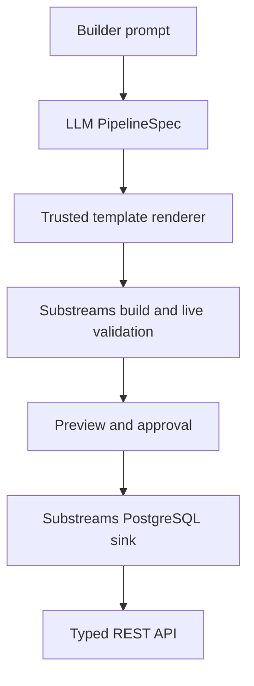
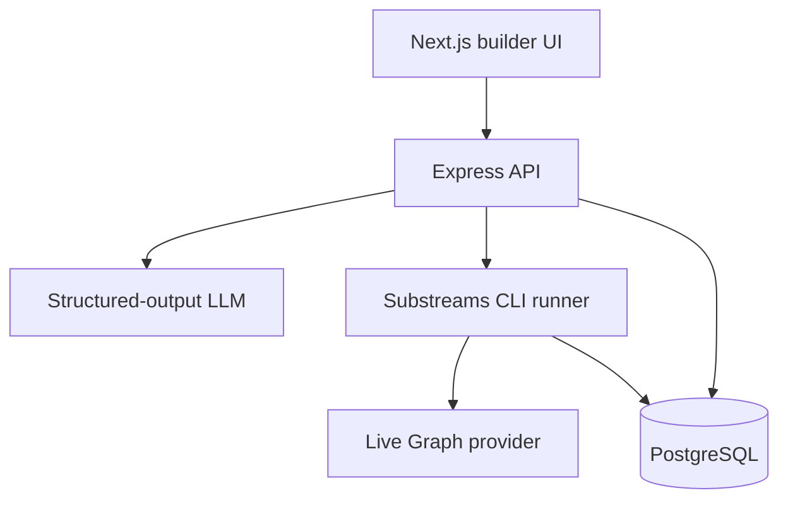

# ETHOnline Coding-Agent Implementation Specification

Specification version: 1.0  
Status: Ready to implement  
Audience: Coding agent and project maintainers  
Last source verification: 2026-09-08  
Implementation order: Complete Phase 1 before beginning Phase 2  
Working project name: `Prompt2API`

## Product definition

> **AI-powered factory for creating live, reusable blockchain data APIs.**

A builder describes a supported blockchain dataset in natural language. The platform turns that request into a validated pipeline specification, configures a trusted Substreams package, builds and tests it against live data from The Graph, starts a PostgreSQL sink, and exposes the resulting dataset through a typed HTTP API.

Phase 2 adds x402. A separate consumer agent requests a data endpoint, receives `402 Payment Required`, pays through Blocky402 on Hedera testnet, retries the request, and receives the data.

## Implementation strategy

Phase 1 proves one complete prompt-to-API path for ERC-4626 vault events on Base.

1. **AI boundary:** the LLM produces a strict `PipelineSpec`. It does not produce Rust, SQL, shell commands, dependencies, or file paths.
2. **Pipeline generation:** the platform renders a reviewed ERC-4626 template using validated values from the `PipelineSpec`.
3. **Build execution:** the API invokes an installed Substreams CLI and Rust toolchain through a constrained process runner.
4. **Job orchestration:** PostgreSQL stores jobs, and one in-process FIFO runner executes a single build or validation job at a time.
5. **Workflow control:** a plain TypeScript state machine enforces legal planning, validation, approval, and deployment transitions.
6. **Data processing:** Substreams filters and normalizes immutable events; PostgreSQL provides hourly and depositor aggregations.
7. **Phase boundary:** x402 payment enforcement and the Hedera consumer agent begin only after all Phase 1 acceptance criteria pass.

---

## 1. Product goal

### Problem

Developers and autonomous agents frequently need a small, specific blockchain dataset, but producing it usually requires:

- Understanding raw EVM blocks and event logs.
- Finding or writing indexing modules.
- Defining output schemas.
- Compiling and validating the indexer.
- Operating a continuously synchronized database.
- Building and documenting an API.

The platform compresses that workflow into one guided prompt-to-deployment flow.

### Phase 1 user story

> As a developer, I can describe an ERC-4626 vault dataset, review how the platform interpreted my request, validate the generated pipeline against live Base data, approve it, and receive a working API endpoint.

### Golden-demo prompt

> Track Deposit and Withdraw events for these ERC-4626 vaults on Base starting at block `<block>`: `<vault A>`, `<vault B>`, and `<vault C>`. Normalize them into one schema and expose raw events and hourly net flows.

### Winning proof

The uninterrupted demonstration must be:

> **One prompt → validated plan → composed Substreams package → live Graph data → preview → approval → PostgreSQL sink → reusable API.**

In Phase 2 it becomes:

> **Reusable API → 402 response → Hedera payment → paid data response.**

---

## 2. Bounty alignment

### The Graph — AI Tooling or AI Use Case, From Scratch

The platform is reusable AI infrastructure that converts natural-language requests into working Substreams deployments. The Graph remains load-bearing because both validation and the continuously running pipeline consume live Substreams data from a Graph provider.

### The Graph — Composable or Standardized Graph Products

The ERC-4626 module produces one normalized schema across multiple vault contracts. It also composes the published `ethereum-common` package rather than rebuilding raw EVM event extraction.

### Hedera — AI & Agentic Payments

Deferred to Phase 2. The deployed data API becomes a real x402-gated metered service, and a separate consumer agent completes a paid request on Hedera through Blocky402.

The official 2026 bounty descriptions specifically mention:

- A single natural-language prompt producing a deployed Substreams pipeline.
- Reusable ERC-4626 vault-flow modules as a composable contribution.
- A real x402-gated service and a consuming agent completing a real payment.

---

## 3. Critical mental model

The AI and the deployed data pipeline have different jobs.

| Component | Responsibility |
| --- | --- |
| LLM | Understand the builder's natural-language request and return a strict `PipelineSpec`. |
| Deterministic TypeScript | Validate the specification, compute event topics and filter expressions, derive safe identifiers, and render trusted templates. |
| Substreams Rust/WASM | Deterministically process blockchain events block by block. |
| The Graph provider | Supply historical and live Base blockchain data and execute the Substreams package. |
| PostgreSQL sink | Persist normalized records and maintain synchronization state. |
| PostgreSQL views | Compute hourly inflow, outflow, net flow, counts, and unique owners. |
| Express API | Serve pipeline control routes and typed dataset routes. |
| Next.js UI | Collect the prompt and show the plan, live preview, deployment status, and API documentation. |

The AI is involved while **creating/configuring** the pipeline. It is not called for every blockchain block or every API query.

---

## 4. Phase 1 scope

### Supported

- Base mainnet only.
- ERC-4626 vault contracts only.
- One to three explicitly supplied contract addresses.
- One explicitly supplied global start block.
- Standard ERC-4626 `Deposit` and `Withdraw` events.
- Either event individually or both together; the golden demo uses both.
- A reviewed and bundled ERC-4626 ABI.
- Normalized immutable event records.
- PostgreSQL hourly aggregation.
- One Substreams-to-PostgreSQL deployment path.
- Typed REST API filters and cursor pagination.
- Human approval before starting the persistent sink.
- Live data from a Graph provider.

### Unsupported

- “Any blockchain request.”
- Chains other than Base.
- Contract discovery from protocol names.
- User-supplied ABIs.
- Arbitrary event signatures or Solidity.
- Arbitrary LLM-generated Rust, SQL, YAML, commands, dependencies, or filesystem paths.
- Traditional Subgraph or GraphQL generation.
- Natural-language SQL.
- Trading, risk scoring, agent reputation, or agent discovery.
- Multiple simultaneous builds.
- Public anonymous pipeline creation.
- x402 during Phase 1.

When a prompt is outside scope, return a clear `UNSUPPORTED_SCOPE` response. Do not guess or pretend it can be implemented.

---

## 5. Terminology

### Module

A single Substreams transformation. For this project:

- `ethereum_common:filtered_events` selects only relevant EVM logs.
- `map_vault_events` decodes and normalizes ERC-4626 events.
- `db_out` converts normalized events into SQL `DatabaseChanges`.

### Pipeline

The connected module graph:

`ethereum_common:filtered_events → map_vault_events → db_out`

### Manifest

`substreams.yaml` declares the package, imports, Protobuf files, WASM binary, modules, parameters, network, and SQL sink configuration.

### Package

The built `.spkg` containing the resolved manifest, Protobuf descriptors, imported modules, and compiled WASM.

### Sink

A long-running process that consumes `db_out` and writes changes into PostgreSQL.

---

## 6. End-to-end Phase 1 flow



### Step 1 — Collect the request

The Create Pipeline screen contains:

- Natural-language prompt.
- Optional structured fields for the three vault addresses and start block.
- Example prompt.
- Clear message that Phase 1 supports Base ERC-4626 vaults only.

Structured fields override values extracted from the prompt. This makes the demo recoverable if the LLM misses an address.

### Step 2 — Produce `PipelineSpec`

Use one structured-output LLM call. It may classify and extract data, but it must return only the documented JSON shape.

The LLM decides:

- Display name.
- Whether Deposit, Withdraw, or both were requested.
- Contract addresses and labels mentioned in the prompt.
- Start block.
- Whether the raw-events and hourly-flow API views were requested.

The LLM does not decide:

- Package names.
- Paths.
- SQL identifiers.
- CLI commands.
- Provider endpoints.
- Dependency versions.
- Event topic hashes.
- Import URLs.
- Database credentials.

### Step 3 — Validate and derive configuration

Deterministic TypeScript performs:

1. Strict Zod validation with unknown keys rejected.
2. EVM address normalization/checksum validation using `viem`.
3. Deduplication of vault addresses.
4. Base-only and ERC-4626-only enforcement.
5. One-to-three-contract enforcement.
6. Start-block range validation.
7. Deterministic slug and package-name generation.
8. Event-topic calculation from the standard ABI.
9. `ethereum-common` filter-expression construction.
10. Safe PostgreSQL schema-name derivation.

### Step 4 — Instantiate the trusted template

Copy the reviewed ERC-4626 template into:

`generated/<pipeline-id>/<version>/`

Only these generated values may vary:

- Package name/version.
- Base network selection.
- Imported module parameters.
- Requested event selection.
- Vault addresses.
- Start block metadata.
- Generated README and example API calls.

The Rust handler, ABI, Protobuf model, Cargo dependencies, and SQL schema come from version-controlled templates. The LLM cannot rewrite them in Phase 1.

### Step 5 — Build

Run from the generated project directory:

```bash
substreams build
```

`substreams build` performs all three relevant operations:

1. Generates Rust types from the Protobuf definitions.
2. Compiles the Rust package to WASM.
3. Creates the deployable `.spkg`.

The `.spkg` emitted by this command is the package used for inspection, live validation, and the PostgreSQL sink.

Then inspect the result:

```bash
substreams info ./substreams.yaml
substreams graph ./substreams.yaml
```

Capture:

- Exit code.
- Standard output/error.
- Start/end timestamps.
- CLI version.
- Rust toolchain version.
- Generated `.spkg` path.
- SHA-256 hash of the rendered source/configuration.
- SHA-256 hash of the `.spkg`.

### Step 6 — Validate using live Graph data

Run `map_vault_events` over a known block range containing real activity:

```bash
substreams run \
  -e "$SUBSTREAMS_ENDPOINT" \
  -s "$VALIDATION_START_BLOCK" \
  -t +"$VALIDATION_BLOCK_COUNT" \
  ./substreams.yaml \
  map_vault_events \
  -o jsonl
```

The validation process must use a real `SUBSTREAMS_API_TOKEN` and live provider. Static JSON fixtures are allowed for unit tests, but they do not satisfy the live acceptance test.

Validate:

- Process exited successfully.
- At least one matching event is returned for the golden fixture.
- Every record's vault address belongs to the requested allowlist.
- `event_id` values are unique.
- Event type is `DEPOSIT` or `WITHDRAW`.
- Assets and shares are unsigned decimal strings.
- Transaction hash, log index, block number, and timestamp are present.
- Deposit has sender and owner.
- Withdraw has sender, receiver, and owner.

Build or validation failures transition to a visible error state. An operator may retry after correcting the template or configuration; Phase 1 does not mutate source code automatically.

### Step 7 — Preview and approve

Display:

- Original prompt.
- Validated `PipelineSpec`.
- Derived `ethereum-common` filter.
- Module graph.
- Imported package and pinned version.
- Build result and package hash.
- Validation checklist.
- 20–50 real decoded event records.

The approval request includes the exact configuration hash and package hash shown in the UI. Reject approval with `409 ARTIFACT_CHANGED` if either hash no longer matches.

### Step 8 — Set up and start PostgreSQL sink

Use the current integrated CLI:

```bash
substreams sink postgres setup \
  ./substreams.yaml \
  --dsn "$DATASET_DSN"

substreams sink postgres \
  ./substreams.yaml \
  -s "$PIPELINE_START_BLOCK" \
  --dsn "$DATASET_DSN"
```

There is no separate `run` subcommand after `sink postgres`.

The API starts the sink as a long-running child process and records:

- Process ID.
- Start time.
- Pipeline/version/hash.
- PostgreSQL schema.
- Current status.
- Last output/log time.
- Last error.

On API startup, query deployments marked `LIVE` and restart their sink process if it is not running. The SQL sink's stored cursor allows it to resume rather than beginning again.

### Step 9 — Serve the dataset

Once PostgreSQL contains records and the sink has advanced, mark the pipeline `LIVE` and expose:

- Normalized events.
- Hourly vault flows.
- Top depositors.
- Metadata and schema.
- Synchronization status.

---

## 7. Substreams module design

### Required composition

Import and pin:

> `ethereum-common@v0.3.3`

Before implementation, run `substreams info ethereum-common@v0.3.3` and confirm:

- `filtered_events` exists.
- Its output is `sf.substreams.ethereum.v1.Events`.
- Its parameter syntax supports `evt_addr:` and `evt_sig:`.
- It runs against the configured Base provider.

Do not silently fall back to scanning every raw block if the import fails. Composition is part of the product and bounty story.

### Deterministically generated filter

The backend computes the standard ABI event selectors and creates:

```text
(evt_addr:<vault-a> || evt_addr:<vault-b>) &&
(evt_sig:<deposit-topic> || evt_sig:<withdraw-topic>)
```

Rules:

- Addresses must be lowercase 0x-prefixed hex in the filter.
- Topics must be derived from the bundled ABI with `viem`.
- Parentheses must be explicit.
- The LLM never writes this expression.

### Module 1 — imported `filtered_events`

Purpose:

- Reuse the optimized EVM event extraction and block index.
- Avoid sending irrelevant logs into local WASM.
- Produce generic successful-transaction EVM events with block and transaction metadata.

### Module 2 — `map_vault_events`

Input:

- `map: ethereum_common:filtered_events`

Output:

- `proto:prompt2api.erc4626.v1.VaultEvents`

Responsibilities:

1. Inspect topic 0.
2. Decode `Deposit(address,address,uint256,uint256)`.
3. Decode `Withdraw(address,address,address,uint256,uint256)`.
4. Convert bytes to lowercase 0x-prefixed strings.
5. Preserve `uint256` assets and shares as base-10 strings.
6. Copy block number, timestamp, transaction hash, and log index.
7. Create `event_id = "<chain-id>:<transaction-hash>:<log-index>"`.
8. Emit one normalized `VaultEvent` per matching log.

Normalized semantics:

| Field | Deposit | Withdraw |
| --- | --- | --- |
| `event_type` | `DEPOSIT` | `WITHDRAW` |
| `sender_address` | Event sender | Event sender |
| `owner_address` | Share owner | Share owner |
| `receiver_address` | Empty/null | Asset receiver |
| `assets_raw` | Deposited assets | Withdrawn assets |
| `shares_raw` | Minted shares | Burned shares |

Do not convert raw amounts into floating-point values. Token decimal metadata is outside Phase 1; API responses clearly label these values as raw integer units.

### Module 3 — `db_out`

Input:

- `map: map_vault_events`

Output:

- `proto:sf.substreams.sink.database.v1.DatabaseChanges`

Responsibilities:

- Convert every normalized event into an insert/upsert for `vault_events`.
- Use `event_id` as the deterministic primary key.
- Map every value to the reviewed SQL schema.
- Emit no hourly aggregate rows.

Hourly values are derived in PostgreSQL so they can be inspected and changed without recompiling the Substreams package.

### Manifest skeleton

The coding agent should generate a valid manifest from official templates rather than blindly copying this illustrative skeleton:

```yaml
specVersion: v0.1.0

package:
  name: generated_erc4626_pipeline
  version: v0.1.0

imports:
  ethereum_common: ethereum-common@v0.3.3

network: base-mainnet

protobuf:
  files:
    - prompt2api/erc4626/v1/vault.proto
  importPaths:
    - ./proto

binaries:
  default:
    type: wasm/rust-v1
    file: ./target/wasm32-unknown-unknown/release/erc4626_pipeline.wasm

modules:
  - name: map_vault_events
    kind: map
    inputs:
      - map: ethereum_common:filtered_events
    output:
      type: proto:prompt2api.erc4626.v1.VaultEvents

  - name: db_out
    kind: map
    inputs:
      - map: map_vault_events
    output:
      type: proto:sf.substreams.sink.database.v1.DatabaseChanges

params:
  "ethereum_common:filtered_events": "<deterministically-generated-filter>"

sink:
  module: db_out
  type: sf.substreams.sink.sql.v1.Service
  config:
    schema: "./schema.sql"
    engine: postgres
```

Verify exact descriptor-set/import requirements for the current SQL sink using the current Substreams skills and Database Changes guide.

---

## 8. Trusted template files

### Version-controlled template

```text
templates/erc4626/
├── Cargo.toml
├── Cargo.lock
├── rust-toolchain.toml
├── substreams.yaml.tmpl
├── buf.gen.yaml
├── proto/
│   └── prompt2api/erc4626/v1/vault.proto
├── src/
│   └── lib.rs
├── abi/
│   └── erc4626.json
├── schema.sql
└── README.template.md
```

Do not include `build.rs` unless the current official template actually requires it. `substreams build` already handles Protobuf generation.

### Per-pipeline output

```text
generated/<pipeline-id>/<version>/
├── pipeline-spec.json
├── Cargo.toml
├── Cargo.lock
├── rust-toolchain.toml
├── substreams.yaml
├── buf.gen.yaml
├── proto/...
├── src/lib.rs
├── abi/erc4626.json
├── schema.sql
├── README.generated.md
├── artifact-manifest.json
├── validation-output.jsonl
└── <package-name>-v0.1.0.spkg
```

The generated directory is an instantiation of reviewed files, not an unconstrained coding workspace.

---

## 9. `PipelineSpec` contract

Implement as a strict Zod schema:

```json
{
  "version": 1,
  "displayName": "Base ERC-4626 Vault Flows",
  "chain": {
    "id": "base-mainnet"
  },
  "standard": "erc4626",
  "contracts": [
    {
      "address": "0x...",
      "label": "Vault A"
    }
  ],
  "startBlock": 12345678,
  "events": ["Deposit", "Withdraw"],
  "outputs": {
    "rawEvents": true,
    "hourlyFlows": true,
    "topDepositors": true
  }
}
```

### Validation rules

- `version` must equal `1`.
- `chain.id` must equal `base-mainnet`.
- `standard` must equal `erc4626`.
- `contracts` length is 1–3.
- Every address is a valid 20-byte EVM address.
- Addresses are unique after lowercase normalization.
- Labels are optional, trimmed, and at most 60 characters.
- `startBlock` is a positive safe integer and not greater than the current known chain head.
- `events` is a non-empty unique subset of `Deposit` and `Withdraw`.
- `rawEvents` is always true.
- Unknown keys are rejected.

### Backend-derived values

The backend derives:

- `pipelineId`.
- Slug and package name.
- Generated directory.
- PostgreSQL schema name.
- Event topics.
- `ethereum-common` filter.
- Validation block range.
- Provider endpoint.
- Import version.
- API URL.
- Artifact hashes.
- CLI arguments.

---

## 10. PostgreSQL design

Use one PostgreSQL instance with:

- `public` schema for platform/control tables.
- One deterministic dataset schema per pipeline, such as `dataset_pl_ab12cd34`.

### `vault_events`

| Column | Type | Notes |
| --- | --- | --- |
| `event_id` | `TEXT PRIMARY KEY` | Chain + transaction hash + log index. |
| `chain_id` | `TEXT NOT NULL` | Always `base-mainnet` in Phase 1. |
| `vault_address` | `TEXT NOT NULL` | Lowercase address. |
| `event_type` | `TEXT NOT NULL` | Check constraint: `DEPOSIT` or `WITHDRAW`. |
| `sender_address` | `TEXT NOT NULL` | From event. |
| `owner_address` | `TEXT NOT NULL` | From event. |
| `receiver_address` | `TEXT NULL` | Only Withdraw. |
| `assets_raw` | `NUMERIC(78,0) NOT NULL` | Lossless uint256. |
| `shares_raw` | `NUMERIC(78,0) NOT NULL` | Lossless uint256. |
| `block_number` | `BIGINT NOT NULL` | Base block. |
| `block_time` | `TIMESTAMPTZ NOT NULL` | UTC. |
| `transaction_hash` | `TEXT NOT NULL` | 0x-prefixed. |
| `log_index` | `INTEGER NOT NULL` | Event position. |

Also add a unique constraint on `(chain_id, transaction_hash, log_index)` and indexes on:

- `(block_number)`
- `(block_time)`
- `(vault_address, block_time)`
- `(owner_address, block_time)`
- `(event_type, block_time)`

### `hourly_vault_flows` view

```sql
CREATE VIEW hourly_vault_flows AS
SELECT
    vault_address,
    date_trunc('hour', block_time) AS hour_start,
    SUM(CASE WHEN event_type = 'DEPOSIT' THEN assets_raw ELSE 0 END) AS inflow_assets_raw,
    SUM(CASE WHEN event_type = 'WITHDRAW' THEN assets_raw ELSE 0 END) AS outflow_assets_raw,
    SUM(CASE
        WHEN event_type = 'DEPOSIT' THEN assets_raw
        ELSE -assets_raw
    END) AS net_assets_raw,
    COUNT(*) FILTER (WHERE event_type = 'DEPOSIT') AS deposit_count,
    COUNT(*) FILTER (WHERE event_type = 'WITHDRAW') AS withdrawal_count,
    COUNT(DISTINCT owner_address) AS unique_owners
FROM vault_events
GROUP BY vault_address, date_trunc('hour', block_time);
```

### Vault labels

Store labels in the control-plane `pipeline_contracts` table rather than encoding them in the blockchain module. The API joins a lowercase vault address to the configured label.

---

## 11. Phase 1 architecture



### Technology responsibilities

| Layer | Technology | Responsibility |
| --- | --- | --- |
| Web | Next.js, TypeScript, Tailwind | Prompt entry, plan review, build status, preview, approval, dataset page. |
| API | Express, TypeScript | Control routes, polling routes, dataset routes, process orchestration, future x402 middleware. |
| LLM | Provider SDK or LangChain structured output | Prompt → `PipelineSpec` only. |
| Validation | Zod and viem | Strict contracts, address validation, topic derivation. |
| State machine | Plain TypeScript | Legal stage transitions. |
| Control persistence | PostgreSQL and Prisma | Pipelines, contracts, versions, runs, deployments. |
| Pipeline | Rust, Protobuf, Substreams manifest | Decode and normalize vault events. |
| Composition | `ethereum-common@v0.3.3` | Optimized filtering of EVM events. |
| Build/runtime | Installed Substreams CLI and Rust toolchain | Build, inspect, graph, run, and sink. |
| Live data | Graph Substreams provider | Historical/live Base blocks and package execution. |
| Dataset persistence | `substreams sink postgres` | Apply `DatabaseChanges` and persist cursor. |
| Aggregation | PostgreSQL view | Hourly totals and top-depositor queries. |

### Deployment assumption

The Express API and long-running sink processes must run on a machine that supports persistent Node child processes, such as a VM or container host. Do not deploy the API/process manager to a serverless platform that terminates background processes.

The Next.js frontend may be hosted separately.

---

## 12. Process runner contract

Implement a small `SubstreamsRunner` adapter around Node's `child_process.spawn`.

### Mandatory rules

- Always use `shell: false`.
- Pass arguments as an array.
- Never place prompt text in a command.
- Use an explicit generated-project working directory.
- Allowlist command names and subcommands.
- Permit only one active build/validation job.
- Apply a wall-clock timeout.
- Capture bounded stdout/stderr.
- Redact tokens and DSNs before persistence/display.
- Kill the child process on timeout or cancellation.

### Environment separation

Build process receives no project secrets:

```text
PATH
RUSTUP_TOOLCHAIN
CARGO_HOME
RUSTUP_HOME
```

Live validation additionally receives:

```text
SUBSTREAMS_API_TOKEN
```

The sink additionally receives:

```text
SUBSTREAMS_API_TOKEN
SUBSTREAMS_SINK_DSN
```

Do not send the LLM API key or unrelated application secrets to any child process.

### In-process queue

Implement a minimal FIFO queue:

- Maximum active jobs: 1.
- Pending jobs stored in PostgreSQL.
- An in-memory loop claims the oldest pending job.
- On API restart, mark interrupted `BUILDING` or `VALIDATING` jobs `FAILED_INTERRUPTED` and allow a manual retry.
- The Phase 1 queue implementation is PostgreSQL plus this in-process runner.

### Sink manager

The `SinkManager`:

- Starts one child process per approved live deployment.
- Stores PID and last-log timestamp.
- Updates status when the process exits.
- Restarts configured `LIVE` deployments on API startup.
- Provides stop/restart methods for the operator.

---

## 13. State machine

```text
DRAFT
  → PLANNING
  → PLAN_READY
  → BUILD_QUEUED
  → BUILDING
  → VALIDATING
  → AWAITING_APPROVAL
  → DEPLOYING
  → LIVE
```

Error/terminal states:

- `NEEDS_INPUT`
- `UNSUPPORTED_SCOPE`
- `PLAN_FAILED`
- `BUILD_FAILED`
- `VALIDATION_FAILED`
- `FAILED_INTERRUPTED`
- `DEPLOYMENT_FAILED`
- `CANCELLED`

Persist every transition with timestamp and reason. Reject illegal transitions.

---

## 14. HTTP API

### Planning and control

```text
POST /v1/pipelines/plan
POST /v1/pipelines/:pipelineId/build
GET  /v1/pipelines/:pipelineId
GET  /v1/pipelines/:pipelineId/logs
GET  /v1/pipelines/:pipelineId/preview
POST /v1/pipelines/:pipelineId/approve
POST /v1/pipelines/:pipelineId/cancel
POST /v1/pipelines/:pipelineId/retry
GET  /v1/pipelines
```

Use polling every 1–2 seconds in Phase 1. SSE is optional and should not block the vertical slice.

#### Plan request

```json
{
  "prompt": "Track Deposit and Withdraw events for these ERC-4626 vaults on Base...",
  "overrides": {
    "contracts": [],
    "startBlock": null
  }
}
```

#### Plan response

```json
{
  "pipelineId": "pl_ab12cd34",
  "status": "PLAN_READY",
  "spec": {},
  "derivedPlan": {
    "importedPackage": "ethereum-common@v0.3.3",
    "modules": [
      "ethereum_common:filtered_events",
      "map_vault_events",
      "db_out"
    ],
    "filterExpression": "..."
  }
}
```

#### Build response

Return `202 Accepted`:

```json
{
  "pipelineId": "pl_ab12cd34",
  "status": "BUILD_QUEUED",
  "statusUrl": "/v1/pipelines/pl_ab12cd34"
}
```

#### Approval request

```json
{
  "configurationHash": "sha256:...",
  "packageHash": "sha256:..."
}
```

### Dataset routes

```text
GET /v1/datasets/:slug/meta
GET /v1/datasets/:slug/schema
GET /v1/datasets/:slug/health
GET /v1/datasets/:slug/events
GET /v1/datasets/:slug/flows/hourly
GET /v1/datasets/:slug/top-depositors
```

Supported event filters:

- `vault`
- `eventType=DEPOSIT|WITHDRAW`
- `owner`
- `from` and `to` as ISO-8601 UTC
- `limit`, maximum 500
- Opaque cursor

Example response:

```json
{
  "dataset": "base-erc4626-vault-flows",
  "version": 1,
  "status": "LIVE",
  "indexedThroughBlock": 12345678,
  "amountUnit": "raw",
  "items": [],
  "nextCursor": null
}
```

Return:

- `400` for invalid filters.
- `404` for unknown datasets.
- `409` for artifact-hash mismatch on approval.
- `422` for unsupported prompts.
- `503 DATASET_SYNCING` until the sink is ready.

All queries must be parameterized. Never expose raw SQL.

---

## 15. Control-plane database

### `pipelines`

- ID
- Original prompt
- Current state
- Validated `PipelineSpec` JSON
- Derived plan JSON
- Slug
- Active version
- Created/updated timestamps

### `pipeline_contracts`

- Pipeline ID
- Lowercase address
- Display label
- Unique pipeline/address constraint

### `pipeline_versions`

- Pipeline ID and version
- Template version
- `ethereum-common` version
- Configuration hash
- Package hash
- Generated directory/artifact location
- Validation range
- Validation result

### `pipeline_runs`

- Pipeline/version
- Stage
- Status
- Attempt
- Exit code
- Sanitized stdout/stderr
- Start/end times
- Error code/message

### `deployments`

- Pipeline/version
- PostgreSQL schema
- Start block
- Process ID
- Status
- Started/stopped timestamps
- Last output time
- Last error

Do not store Graph tokens, database passwords, or future Hedera private keys.

---

## 16. Recommended repository structure

```text
/
├── apps/
│   ├── web/                         # Next.js UI
│   └── api/                         # Express API, job runner, sink manager
├── packages/
│   ├── contracts/                   # Zod schemas and shared DTOs
│   ├── db/                          # Prisma schema/migrations/repositories
│   ├── planner/                     # Prompt -> PipelineSpec
│   ├── pipeline-config/             # Deterministic derivation and filters
│   ├── generator/                   # Trusted template renderer
│   ├── substreams-runner/           # spawn wrappers and output parsers
│   └── dataset-service/             # Parameterized dataset queries
├── templates/
│   └── erc4626/
│       ├── Cargo.toml
│       ├── Cargo.lock
│       ├── rust-toolchain.toml
│       ├── substreams.yaml.tmpl
│       ├── buf.gen.yaml
│       ├── proto/prompt2api/erc4626/v1/vault.proto
│       ├── src/lib.rs
│       ├── abi/erc4626.json
│       ├── schema.sql
│       └── README.template.md
├── generated/
│   └── golden-erc4626/              # Checked-in judge-inspectable output
├── fixtures/
│   ├── base-vaults.json
│   ├── live-validation-ranges.json
│   └── expected-events.json
├── docs/
│   ├── architecture.md
│   ├── demo.md
│   └── phase-2-x402.md
├── package.json
├── pnpm-workspace.yaml
└── README.md
```

Phase 1 runs as the web app, API, PostgreSQL, and the installed Rust/Substreams toolchain. A developer may run PostgreSQL locally or use a hosted PostgreSQL instance. Build and validation jobs execute on the API host through the constrained process runner.

---

## 17. UI requirements

### Create page

- Prompt box.
- Supported-scope callout.
- Example prompt button.
- Optional address/start-block overrides.
- “Generate plan” button.

### Plan page

- Parsed chain, standard, contracts, events, and start block.
- Imported `ethereum-common` package.
- Three-module graph.
- Derived filter expression.
- “Build and validate” button.

### Build page

- Current state.
- Sanitized command label, not the secret-bearing command.
- Build logs.
- Validation checklist.
- Real event preview.
- Configuration and package hashes.
- “Approve and deploy” button.

### Dataset page

- `LIVE/SYNCING/FAILED` status.
- Contract list and labels.
- API schema.
- Indexed-through block where available.
- Sample cURL and TypeScript requests.
- Tables for events and hourly flows.
- Phase 2 placeholder: “Paid access coming next.”

---

## 18. Implementation milestones

### Milestone 0 — Manual feasibility spike

Do this before the platform or AI work:

1. Install and pin current Rust and Substreams CLI versions.
2. Read the official Substreams development, EVM, SQL, testing, and sink skills.
3. Select two or three real Base ERC-4626 vaults and known active block ranges.
4. Inspect `ethereum-common@v0.3.3`.
5. Hand-build `map_vault_events` and `db_out`.
6. Run `substreams build` successfully.
7. Run `map_vault_events` against live Graph data.
8. Start `substreams sink postgres` and confirm PostgreSQL rows.
9. Confirm hourly SQL view results.
10. Record exact versions, commands, vaults, ranges, and expected transaction hashes in fixtures.

Exit criterion: one manual prompt-independent package works end to end.

### Milestone 1 — Trusted reusable template

- Turn the manual package into `templates/erc4626`.
- Parameterize only the manifest filter/package metadata.
- Add deterministic template tests.
- Check in `generated/golden-erc4626`.

Exit criterion: a static `PipelineSpec` produces a buildable package.

### Milestone 2 — Control API and runner

- Create Express API and Prisma models.
- Implement state machine.
- Implement `SubstreamsRunner`.
- Implement in-process single-job queue.
- Implement build, info, graph, and live-validation stages.
- Parse JSONL preview output.

Exit criterion: API request with a static spec reaches `AWAITING_APPROVAL`.

### Milestone 3 — Approval, sink, and dataset API

- Bind approval to hashes.
- Implement `SinkManager`.
- Implement schema setup and persistent sink.
- Implement dataset metadata/events/hourly/top-depositor routes.
- Add cursor pagination.

Exit criterion: approval produces a continuously updated API.

### Milestone 4 — AI planning

- Add structured-output LLM call.
- Add strict Zod validation.
- Add one retry only for malformed model output.
- Add `NEEDS_INPUT` and `UNSUPPORTED_SCOPE` responses.
- Test prompt variations.

Exit criterion: natural-language prompt reaches the same deterministic pipeline path without manual JSON editing.

### Milestone 5 — Frontend and demo

- Implement Create, Plan, Build, and Dataset pages.
- Add polling.
- Show real preview records and module graph.
- Add copyable API examples.
- Write the two-to-four-minute Graph bounty demo script.

### Milestone 6 — Reproducibility and evaluation

- Fresh-clone setup test.
- Five supported prompt variations.
- Five unsupported prompt tests.
- Live golden-fixture test.
- README with architecture, versions, setup, and demo.
- Public repository and visible hackathon commit history.

Only after these milestones pass may Phase 2 begin.

---

## 19. Test plan

### Unit tests

- `PipelineSpec` acceptance/rejection.
- Address normalization and deduplication.
- Event selection.
- Event-topic derivation.
- Filter-expression escaping and parenthesization.
- Safe slug/package/schema identifiers.
- Legal state transitions.
- Cursor encode/decode.
- Hourly API query validation.

### Template tests

- Rendered files match an allowlisted file set.
- Fixed files are byte-identical to reviewed templates.
- Only approved manifest placeholders change.
- Render is deterministic for the same spec.
- No prompt text appears in code, SQL, paths, or commands.

### Rust/Substreams tests

- Decode known Deposit log.
- Decode known Withdraw log.
- Reject unknown topic.
- Preserve maximum-width uint256 as a decimal string.
- Deterministic event ID.
- `db_out` maps every field correctly.

### Integration tests

- `substreams build` creates `.spkg`.
- `substreams info` reports expected modules.
- Live run returns the expected known events.
- PostgreSQL setup creates expected tables/view.
- Sink inserts events and resumes from stored cursor.
- API filters and pagination return correct data.

### End-to-end test

```text
Prompt
→ PLAN_READY
→ BUILD_QUEUED
→ BUILDING
→ VALIDATING
→ AWAITING_APPROVAL
→ approval with matching hashes
→ DEPLOYING
→ LIVE
→ REST response containing a known onchain event
```

---

## 20. Phase 1 definition of done

Phase 1 is complete only when:

- One natural-language ERC-4626 prompt produces a valid `PipelineSpec` without manual JSON editing.
- Unsupported prompts are rejected honestly.
- The generated manifest imports pinned `ethereum-common` and uses `filtered_events`.
- The filter is generated deterministically from validated addresses and standard ABI topics.
- `substreams build` creates an inspectable `.spkg`.
- The package runs against a live Graph provider.
- The UI displays real decoded Base events.
- Approval is bound to the previewed hashes.
- Approval starts `substreams sink postgres`.
- PostgreSQL contains normalized records.
- The hourly view returns correct inflow, outflow, and net flow.
- Typed REST endpoints return filtered, paginated results.
- A stopped/restarted sink continues from its cursor.
- A fresh repository clone can reproduce the golden demo.
- The accepted implementation uses the direct CLI runner, PostgreSQL-backed FIFO queue, plain TypeScript state machine, and reviewed code templates.

---

## 21. Security boundary

This design is acceptable because users configure a reviewed template; they do not submit executable code.

Mandatory restrictions:

- LLM output is treated as untrusted JSON.
- Only fixed template files may enter the generated directory.
- `Cargo.toml`, `Cargo.lock`, Rust source, ABI, Protobuf, and SQL are operator-controlled.
- No `build.rs` unless reviewed and required.
- No arbitrary package imports.
- No shell interpolation.
- Build process receives no secrets.
- Graph token is provided only to live-run/sink commands.
- Database DSN is provided only to sink/database code.
- Logs are sanitized.
- Pipeline creation is not exposed anonymously.

If the product later allows the LLM or users to generate arbitrary Rust, dependencies, build scripts, or uploaded packages, restore a sandboxed container/VM build service before public release. Cargo build scripts execute host programs during compilation, so arbitrary code must not be compiled inside the ordinary API process.

---

## 22. Phase 2 boundary: x402 on Hedera

Do not implement Phase 2 yet, but preserve these interfaces:

- Keep free metadata/schema/health routes separate from data-bearing routes.
- Put dataset-query logic in a service function that future payment middleware can call after authorization.
- Keep the Express API so the current x402 middleware ecosystem can be integrated.
- Add a future `pricing` configuration field to `api_products` without using it in Phase 1.
- Keep the future payer agent in a separate app/process with separate secrets.

Later Phase 2 flow:

```text
Consumer agent
→ GET paid data route
→ HTTP 402 requirements
→ validate price/network/recipient
→ sign HBAR payment
→ Blocky402 verify and settle
→ retry request
→ receive Graph-derived data and Hedera receipt
```

The current Blocky402 quickstart uses x402 v2, `hedera:testnet`, `@x402/hedera`, facilitator discovery through `/supported`, and separate verify/settle operations. Recheck exact package compatibility when Phase 2 begins.

---

## 23. Golden demo sequence

1. Open an empty Create Pipeline page.
2. Paste the golden ERC-4626 prompt with two or three real Base vaults.
3. Show the LLM-produced `PipelineSpec`.
4. Show that the plan imports `ethereum-common@v0.3.3`.
5. Show the deterministic address/topic filter.
6. Click “Build and validate.”
7. Show `substreams build` success and the generated module graph.
8. Show real live-provider Deposit/Withdraw records.
9. Approve the exact configuration/package hashes.
10. Show the PostgreSQL sink starting and records appearing.
11. Call the raw-events API.
12. Call the hourly-flows API.
13. Explain that Phase 2 places x402 in front of the same data route.

The Graph demo video should stay between two and four minutes.

---

## 24. Instructions to the coding agent

1. Implement Phase 1 only.
2. Begin with the manual feasibility spike.
3. Read the current official Substreams skills before writing the package.
4. Use `substreams build` for Protobuf generation, Rust compilation, and `.spkg` creation; use `substreams sink postgres` for database setup and execution.
5. Confirm `ethereum-common@v0.3.3` with `substreams info` before depending on it.
6. Do not let the LLM write source code or commands.
7. Keep orchestration within the documented API process, PostgreSQL job table, and plain TypeScript state machine.
8. Do not begin the frontend until the manual live Substreams-to-PostgreSQL path works.
9. Do not claim deployment from mocked or static data.
10. Commit every working milestone so the From Scratch history is evident.
11. When documentation and this file conflict, prefer the current official documentation and record the change in the README.
12. Stop after Phase 1 acceptance tests and report evidence before starting x402.

---

## 25. Environment configuration

```text
# Application
NODE_ENV=development
PORT=4000
DATABASE_URL=
PUBLIC_APP_URL=

# LLM
LLM_API_KEY=
LLM_MODEL=
PLANNER_PROMPT_VERSION=v1

# Substreams
SUBSTREAMS_ENDPOINT=
SUBSTREAMS_API_TOKEN=
SUBSTREAMS_CLI_PATH=substreams
SUBSTREAMS_TEMPLATE_VERSION=v1
ETHEREUM_COMMON_PACKAGE=ethereum-common@v0.3.3

# Generated artifacts and limits
ARTIFACT_ROOT=
BUILD_TIMEOUT_SECONDS=300
VALIDATION_TIMEOUT_SECONDS=180
VALIDATION_BLOCK_COUNT=1000
MAX_ACTIVE_PIPELINE_JOBS=1

# PostgreSQL sink
DATASET_DATABASE_URL=
```

Validate configuration at startup. Never expose secret values through browser-prefixed environment variables.

---

## 26. Authoritative references

Implementation details were verified against these sources on 2026-09-08:

- [ETHOnline 2026 — The Graph prizes](https://ethglobal.com/events/ethonline2026/prizes/the-graph)
- [Substreams CLI reference](https://docs.substreams.dev/reference-material/command-line-interface)
- [Substreams manifest reference](https://docs.substreams.dev/reference-material/manifest-and-components/manifests)
- [Substreams module concepts](https://docs.substreams.dev/reference-material/core-concepts/modules)
- [Substreams `ethereum-common` package](https://substreams.dev/packages/ethereum-common/v0.3.3)
- [Substreams SQL — Database Changes mode](https://docs.substreams.dev/how-to-guides/sinks/sql/db_out)
- [Substreams SQL — current CLI migration](https://docs.substreams.dev/how-to-guides/sinks/sql/migration)
- [Substreams SQL — relational mappings](https://docs.substreams.dev/how-to-guides/sinks/sql/relational-mappings)
- [Substreams SQL — reorg handling](https://docs.substreams.dev/reference-material/sql/sql/reorg-handling)
- [Substreams Skills](https://github.com/streamingfast/substreams-skills)
- [Cargo build-script behavior](https://doc.rust-lang.org/cargo/reference/build-scripts.html)
- [ETHOnline 2026 — Hedera prizes](https://ethglobal.com/events/ethonline2026/prizes/hedera)
- [Hedera — x402 overview](https://docs.hedera.com/solutions/ai/x402)
- [Blocky402 quickstart](https://blocky402.com/docs/quickstart/)
