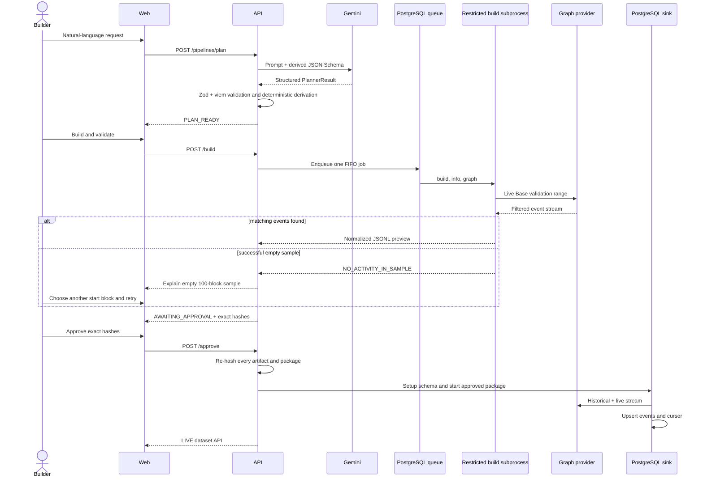

# Phase 1 architecture

## Trust boundaries

Prompt2API separates interpretation from execution. Gemini receives a builder prompt and a JSON Schema derived from the Zod `PlannerResultSchema`. It can return a ready `PipelineSpec`, clarification questions, or an unsupported classification. Its output is never a command or source file. No unvalidated model output is passed to a command or child process.

The backend parses the response as JSON and validates it with the same strict Zod contract. It then validates and normalizes every address with `viem`, enforces Base/ERC-4626/event/block/count limits, derives event selectors and filter expressions, and creates safe identifiers. Only this validated representation reaches the template renderer.

The renderer copies an allowlisted reviewed template. Fixed Rust, Protobuf, ABI, SQL, lockfile, and toolchain files must match their expected content. Only reviewed manifest/readme placeholders vary. An artifact manifest records hashes for later approval verification.

## Runtime flow



## State and recovery

All pipeline transitions are checked by a plain TypeScript state machine and persisted with timestamps and reasons. PostgreSQL stores the single-job FIFO queue. Startup marks interrupted build/validation runs as failed and restarts deployments recorded as live. The SQL sink resumes from its stored cursor; deterministic event IDs prevent duplicate records.

## Data model

`map_vault_events` emits immutable normalized events with lowercase addresses, raw decimal `uint256` strings, block/transaction/log metadata, and an event ID of `base-mainnet:<transaction-hash>:<log-index>`. `db_out` writes those events. PostgreSQL views derive hourly inflow, outflow, net flow, counts, and unique owners. The dataset service adds validated filters and keyset pagination without exposing SQL.

## Composability proof

The manifest imports `ethereum-common@v0.3.3` and connects `ethereum_common:filtered_events` directly to the reviewed `map_vault_events` module. For two vaults, backend code derives one explicitly grouped filter:

```text
(evt_addr:vault_a || evt_addr:vault_b) &&
(evt_sig:deposit_topic || evt_sig:withdraw_topic)
```

Both vaults still pass through the same Rust mapper and the same `prompt2api.erc4626.v1.VaultEvent` schema. The generator changes only validated manifest parameters; it does not fork the Rust, Protobuf, ABI, or SQL. Unit tests assert the exact grouping, both normalized addresses, the imported module input, and the common output type.

## Restricted build subprocess

The Phase 1 runner is intentionally direct because it compiles only operator-reviewed templates. This is a restricted subprocess, not an OS/container sandbox. It uses `spawn` with `shell: false`, fixed commands, canonical paths under the artifact root, output limits, timeouts, cancellation, and a reduced environment. Generated versions share a Cargo target cache; matching reviewed WASM is packaged only after its Rust, protobuf, ABI, Cargo, toolchain, and build-script inputs pass a SHA-256 fingerprint check. The build receives no secrets; live validation receives only the Graph token; the sink receives the Graph token and DSN.

Allowing arbitrary source, Cargo dependencies, build scripts, uploaded packages, or model-generated executable content would invalidate this boundary and require isolated container/VM compilation before public use.
