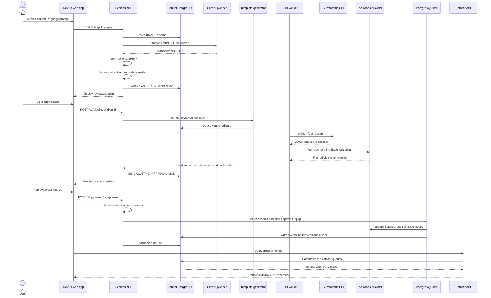

# IndexLoom Phase 1: end-to-end flow and component ownership

This document explains what happens from the moment a user submits a natural-language
request until IndexLoom exposes a continuously updated dataset API. It also identifies
which parts are:

- written and reviewed by the IndexLoom developers;
- proposed dynamically by Gemini;
- derived deterministically by backend code; or
- produced at build/runtime by trusted tools and live blockchain data.

## 1. The most important boundary

Gemini does **not** generate a Substreams project. It does not generate Rust, Protobuf,
SQL, manifests, dependencies, commands, paths, or package files.

Gemini proposes only a small JSON `PlannerResult`. For a supported request, that result
contains a `PipelineSpec` describing the user's intent:

```json
{
  "status": "ready",
  "spec": {
    "version": 1,
    "displayName": "Base ERC-4626 Vault Flows",
    "chain": { "id": "base-mainnet" },
    "standard": "erc4626",
    "contracts": [
      {
        "address": "0x050ce30b927da55177a4914ec73480238bad56f0",
        "label": "Target Vault"
      }
    ],
    "startBlock": 50999146,
    "events": ["Deposit", "Withdraw"],
    "outputs": {
      "rawEvents": true,
      "hourlyFlows": true,
      "topDepositors": false
    }
  }
}
```

The backend treats this as an untrusted proposal. It parses and validates it before it
can affect any generated artifact or process.

```text
User language
    |
    v
Gemini proposes constrained JSON
    |
    v
Zod + viem validate and normalize it
    |
    v
Backend code derives all executable configuration
    |
    v
Reviewed template is copied and rendered
```

## 2. Ownership legend

The rest of this document uses four ownership classes.

| Class | Meaning | Example |
| --- | --- | --- |
| Fixed and reviewed | Source committed by the IndexLoom developers | Rust mapper, ABI, Protobuf, SQL schema |
| LLM-proposed | A constrained value inferred by Gemini from the prompt | vault address, requested events, start block |
| Backend-derived | Produced by ordinary deterministic TypeScript after validation | event topics, filter, slug, schema name |
| Build/runtime-produced | Produced by trusted tools or external data | WASM binary, `.spkg`, validation events, database rows |

Only the second class comes from the LLM. The LLM never produces an executable
component.

## 3. Complete lifecycle



The normal state progression is:

```text
DRAFT
  -> PLANNING
  -> PLAN_READY
  -> BUILD_QUEUED
  -> BUILDING
  -> VALIDATING
  -> AWAITING_APPROVAL
  -> DEPLOYING
  -> LIVE
```

Every transition is validated by the state machine and persisted with a timestamp and
reason.

## 4. Step 1: prompt submission

The form is implemented in
[`apps/web/components/create-pipeline.tsx`](../apps/web/components/create-pipeline.tsx).

The user supplies free-form text and may optionally supply structured recovery
overrides:

- one to three vault addresses;
- a start block.

The browser sends the request to the Next.js `/control` route. The proxy in
[`apps/web/app/control/[...path]/route.ts`](../apps/web/app/control/%5B...path%5D/route.ts)
forwards it to the Express API. This keeps `GEMINI_API_KEY`, the Substreams token,
database credentials, and an optional operator token on the server.

### Ownership at this step

| Item | Owner |
| --- | --- |
| Prompt text | User |
| Optional structured overrides | User |
| Form, length limit and API route | Fixed and reviewed |
| Pipeline ID such as `pl_db751a4787` | Backend-generated random identifier |

The API records the original prompt before calling Gemini so planning attempts and
failures remain auditable.

## 5. Step 2: LLM planning

The provider-independent interface is defined in
[`packages/contracts/src/index.ts`](../packages/contracts/src/index.ts):

```ts
interface PipelinePlanner {
  plan(prompt: string): Promise<PlannerResult>;
}
```

The Phase 1 implementation is `GeminiPipelinePlanner` in
[`packages/planner/src/index.ts`](../packages/planner/src/index.ts).

The backend sends Gemini:

- the user's prompt;
- a fixed Phase 1 system instruction;
- the configured prompt version;
- a JSON Schema derived from the Zod `PlannerResultSchema`.

Gemini must return exactly one of:

1. `ready` with a `PipelineSpec`;
2. `needs_clarification` with questions; or
3. `unsupported` with a reason.

### What Gemini may propose

For a `ready` plan, Gemini proposes values for these fields:

| Field | Constraint enforced by the backend |
| --- | --- |
| `displayName` | 1-100 characters |
| `chain.id` | Exactly `base-mainnet` |
| `standard` | Exactly `erc4626` |
| `contracts` | 1-3 explicitly supplied valid EVM addresses |
| `contracts[].label` | Optional, 1-60 characters |
| `startBlock` | Non-negative safe integer |
| `events` | Unique `Deposit` and/or `Withdraw` values only |
| `outputs.rawEvents` | Always `true` |
| `outputs.hourlyFlows` | Boolean |
| `outputs.topDepositors` | Must remain `false` in Phase 1 |

Some fields are technically returned by Gemini but have only one permitted value. The
model is selecting within a contract, not designing the pipeline architecture.

Structured address/start-block overrides are applied again after the model responds,
so explicit builder controls take precedence over prose interpretation.

### What Gemini cannot produce

The planner rejects model output containing implementation material such as:

- Rust or other source code;
- SQL;
- shell commands;
- package/dependency names;
- file paths;
- manifest filenames;
- arbitrary extra JSON fields.

Provider failure does not produce a default plan. Transient provider errors receive at
most one application-level retry; a final failure is surfaced as
`PLANNER_UNAVAILABLE`.

## 6. Step 3: backend validation and deterministic derivation

The strict schemas and address checks are in
[`packages/contracts/src/index.ts`](../packages/contracts/src/index.ts). The planning
orchestration is in
[`apps/api/src/pipeline-service.ts`](../apps/api/src/pipeline-service.ts).

After Zod parsing, `viem` confirms each address and the backend normalizes addresses to
lowercase. Duplicate addresses and events are rejected.

Then [`packages/pipeline-config/src/index.ts`](../packages/pipeline-config/src/index.ts)
derives the executable configuration using deterministic code.

### Backend-derived values

| Value | How it is derived | LLM-generated? |
| --- | --- | --- |
| Deposit topic | `viem.toEventSelector` over the fixed ERC-4626 Deposit ABI | No |
| Withdraw topic | `viem.toEventSelector` over the fixed ERC-4626 Withdraw ABI | No |
| Address/topic filter | Joined from validated addresses and supported event topics | No |
| Dataset slug | Sanitized display name plus pipeline-ID suffix | No |
| Package name | Sanitized display name plus pipeline-ID suffix | No |
| PostgreSQL schema | `dataset_<pipeline-id>` | No |
| Pipeline version | Backend-controlled positive integer | No |
| Imported package | Fixed `ethereum-common@v0.3.3` | No |
| Module graph | Fixed `filtered_events -> map_vault_events -> db_out` | No |
| Artifact directory | Safe path under `ARTIFACT_ROOT` | No |
| Validation stop block | `startBlock + VALIDATION_BLOCK_COUNT` | No |

For example, a validated address and two supported events become:

```text
(evt_addr:0x050ce30b927da55177a4914ec73480238bad56f0) &&
(evt_sig:<Deposit topic> || evt_sig:<Withdraw topic>)
```

Gemini never writes that filter expression.

## 7. Step 4: reviewed template rendering

The generator is implemented in
[`packages/generator/src/index.ts`](../packages/generator/src/index.ts). It renders into:

```text
generated/<pipeline-id>/<pipeline-version>/
```

The generator accepts only safe artifact subdirectories and resolves every file under
the configured template/artifact roots. The output directory must be empty.

### Files copied byte-for-byte

These files are written and reviewed by the IndexLoom developers and copied unchanged
for every Phase 1 pipeline:

| Fixed file | Purpose |
| --- | --- |
| [`Cargo.toml`](../templates/erc4626/Cargo.toml) | Approved Rust crate and dependency declarations |
| [`Cargo.lock`](../templates/erc4626/Cargo.lock) | Exact reproducible Rust dependency versions |
| [`rust-toolchain.toml`](../templates/erc4626/rust-toolchain.toml) | Rust/WASM toolchain selection |
| [`buf.gen.yaml`](../templates/erc4626/buf.gen.yaml) | Protobuf generation configuration |
| [`build.rs`](../templates/erc4626/build.rs) | Generates Rust ABI and Protobuf bindings |
| [`vault.proto`](../templates/erc4626/proto/indexloom/erc4626/v1/vault.proto) | Deposit, Withdraw and VaultEvents message shapes |
| [`src/lib.rs`](../templates/erc4626/src/lib.rs) | Reviewed Deposit/Withdraw decoder and database mapper |
| [`src/abi/mod.rs`](../templates/erc4626/src/abi/mod.rs) | Rust ABI module declaration |
| [`erc4626.json`](../templates/erc4626/abi/erc4626.json) | Fixed ERC-4626 Deposit/Withdraw ABI |
| [`schema.sql`](../templates/erc4626/schema.sql) | `vault_events` table, indexes and hourly-flow view |

The LLM cannot modify any of these files or add a file to this allowlist.

### Files rendered from reviewed templates

Two files have fixed structure but contain deterministic variable values.

#### `substreams.yaml`

The source template is
[`substreams.yaml.tmpl`](../templates/erc4626/substreams.yaml.tmpl). Only these
placeholders are accepted:

| Placeholder | Source |
| --- | --- |
| `PACKAGE_NAME` | Backend-derived safe identifier |
| `START_BLOCK` | Validated `PipelineSpec.startBlock` |
| `FILTER_SINGLE_LINE` | Backend-derived address/topic filter |

Everything else is fixed, including:

- network `base`;
- imported package URLs and versions;
- WASM location;
- module names and connections;
- output Protobuf types;
- PostgreSQL sink type;
- SQL schema location.

#### `README.generated.md`

The source template is
[`README.template.md`](../templates/erc4626/README.template.md). It receives escaped,
informational values such as display name, pipeline ID, version, start block, selected
events, vaults and filter. It is documentation, not executable input.

### Files generated directly by backend code

| File | Contents |
| --- | --- |
| `pipeline-spec.json` | Stable JSON serialization of the validated/normalized spec |
| `artifact-manifest.json` | Allowlisted file paths and SHA-256 hash of every artifact |

The generator rejects unknown or unresolved placeholders. It does not evaluate template
text as code.

## 8. What the fixed executable components do

### ERC-4626 ABI

[`templates/erc4626/abi/erc4626.json`](../templates/erc4626/abi/erc4626.json)
describes the binary layout of Deposit and Withdraw Ethereum logs. `build.rs` uses it to
generate typed Rust decoders.

### Protobuf messages

[`vault.proto`](../templates/erc4626/proto/indexloom/erc4626/v1/vault.proto)
defines the structured records exchanged between modules:

- `Deposit`;
- `Withdraw`;
- `VaultEvents`.

Protobuf is the typed wire contract between the event mapper and downstream modules.

### Rust/WASM mapper

[`src/lib.rs`](../templates/erc4626/src/lib.rs) contains two fixed Substreams handlers:

1. `map_vault_events` decodes filtered logs into normalized Deposit/Withdraw messages.
2. `db_out` converts those messages into deterministic PostgreSQL row changes.

The mapper preserves `uint256` asset/share values as decimal strings so JavaScript does
not lose precision. It also records chain, block, transaction and log metadata and
constructs this stable ID:

```text
base-mainnet:<transaction-hash>:<log-index>
```

### SQL schema

[`schema.sql`](../templates/erc4626/schema.sql) creates:

- the normalized `vault_events` table;
- uniqueness and query indexes; and
- the `hourly_vault_flows` view.

The view calculates hourly inflow, outflow, net flow, counts and unique owners without
changing or recompiling the WASM module.

### Substreams manifest

The rendered `substreams.yaml` wires the fixed dataflow together:

```text
Base logs
  -> ethereum_common:filtered_events
  -> map_vault_events (IndexLoom Rust/WASM)
  -> db_out (database changes)
  -> PostgreSQL sink
```

## 9. Step 5: build and package inspection

When the user clicks **Build & validate**, the API first renders a new immutable version
of the project and queues one build job in PostgreSQL.

The worker in [`apps/api/src/build-worker.ts`](../apps/api/src/build-worker.ts) invokes
the runner in
[`packages/substreams-runner/src/index.ts`](../packages/substreams-runner/src/index.ts).

The trusted runner performs these stages:

1. `substreams build` compiles the fixed Rust into WASM and creates a `.spkg`.
2. `substreams info` inspects package metadata.
3. `substreams graph` inspects the composed module graph.

Commands are assembled by backend code and started with `shell: false`. The project
directory must resolve inside `ARTIFACT_ROOT`. Output is bounded, execution has a
timeout, and build processes receive no Gemini/database credentials.

### Build/runtime-produced artifacts

| Artifact | Producer | LLM-generated? |
| --- | --- | --- |
| Generated ABI Rust bindings | Reviewed `build.rs` | No |
| Generated Protobuf Rust bindings | Reviewed `build.rs` | No |
| WASM binary | Rust compiler from fixed source | No |
| `.spkg` package | Substreams CLI from reviewed/rendered inputs | No |
| Build/info/graph logs | Substreams CLI | No |

The `.spkg` is the deployable package containing the WASM module, Protobuf definitions,
manifest configuration and module graph.

## 10. Step 6: live Base validation

After a successful build, the worker runs the package over a bounded block range:

```text
[startBlock, startBlock + VALIDATION_BLOCK_COUNT)
```

The Graph's Substreams endpoint supplies real Base data. The backend parses the JSONL
output and checks:

- at least one matching event exists;
- all vaults are in the configured allowlist;
- event types are Deposit or Withdraw only;
- event IDs are unique;
- raw amounts are unsigned decimal integers;
- required chain/block/transaction fields exist;
- Withdraw records include a receiver.

The runtime writes `validation-output.jsonl`, calculates the `.spkg` SHA-256 hash and
stores a bounded event preview and checklist in the control database.

These records are live-provider results. They are neither LLM-generated nor static
template data.

## 11. Step 7: hash-bound human approval

After validation the UI receives:

- a configuration hash derived from `artifact-manifest.json`;
- the exact `.spkg` package hash;
- the live validation preview.

When the user approves, the browser returns both hashes. The approval service in
[`apps/api/src/approval-service.ts`](../apps/api/src/approval-service.ts):

1. re-hashes every allowlisted artifact;
2. confirms the specification hash;
3. requires exactly one `.spkg`;
4. re-hashes that package; and
5. compares the results with the values the user approved.

If anything changed between preview and approval, deployment stops with
`ARTIFACT_CHANGED`.

Approval therefore means: **deploy exactly the source/configuration and package that
were reviewed and validated**, not merely a pipeline with the same name.

## 12. Step 8: deployment and continuous ingestion

The sink manager in
[`apps/api/src/sink-manager.ts`](../apps/api/src/sink-manager.ts) receives only trusted,
backend-held values:

- canonical artifact directory;
- approved package file;
- fixed endpoint;
- validated start block;
- backend-derived schema name;
- server-side Substreams token and PostgreSQL DSN.

It first provisions an isolated dataset schema and runs the Substreams PostgreSQL setup
operation. It then starts the approved package as a long-running sink.

```text
Historical Base blocks from startBlock
    -> live head
    -> fixed WASM decoder
    -> DatabaseChanges
    -> dataset-specific PostgreSQL schema
```

The sink stores its cursor, allowing it to resume from persisted progress. Deterministic
event IDs and database uniqueness constraints prevent duplicate event rows.

The changing **Indexed through** value on the dataset page is the sink's persisted
block cursor advancing as new blocks are processed.

## 13. Step 9: reusable dataset API

The data-serving logic is in
[`packages/dataset-service/src/index.ts`](../packages/dataset-service/src/index.ts).
The Express routes are in [`apps/api/src/app.ts`](../apps/api/src/app.ts).

Phase 1 exposes routes such as:

```text
GET /v1/datasets/:slug/meta
GET /v1/datasets/:slug/schema
GET /v1/datasets/:slug/health
GET /v1/datasets/:slug/events
GET /v1/datasets/:slug/hourly-flows
```

The API maps the public slug to the backend-derived schema, validates filters and uses
parameterized SQL. Raw events come from `vault_events`; aggregates come from
`hourly_vault_flows`.

The JSON returned by these endpoints is runtime data derived from Base and PostgreSQL,
not output generated by Gemini.

## 14. Component-generation matrix

This is the quickest reference for deciding who controls each piece.

| Component/value | Fixed by IndexLoom | Proposed by LLM | Backend-derived | Tool/live-produced |
| --- | :---: | :---: | :---: | :---: |
| User prompt |  |  |  | User input |
| `PlannerResult` classification |  | Yes |  |  |
| `PipelineSpec` values | Constraints/schema | Yes | Normalized/overridden |  |
| Base/ERC-4626 scope | Yes | Must echo valid values | Enforced |  |
| Rust event mapper | Yes | No | No |  |
| ERC-4626 ABI | Yes | No | No |  |
| Protobuf definitions | Yes | No | No |  |
| SQL schema and hourly view | Yes | No | No |  |
| Cargo dependencies/lockfile | Yes | No | No |  |
| Imported `ethereum-common@v0.3.3` | Yes | No | Referenced by code |  |
| Module graph | Yes | No | Selected as fixed graph |  |
| Event signature topics | ABI definition | No | Yes, through `viem` |  |
| Filter expression | Grammar | No | Yes |  |
| Slug/package/schema identifiers | Rules | No | Yes |  |
| Start block in manifest | Placeholder | Initial value | Validated and rendered |  |
| Vaults in filter |  | Initial values | Validated and rendered |  |
| `pipeline-spec.json` | Format | Source values | Serialized |  |
| `artifact-manifest.json` | Format/allowlist | No | Paths and hashes |  |
| ABI/Protobuf Rust bindings | Generator code | No | No | Build script |
| WASM binary | Source/toolchain | No | No | Rust compiler |
| `.spkg` | Package structure | No | No | Substreams CLI |
| Validation preview | Validation rules | No | No | Live Base data |
| Configuration/package hashes | Hash rules | No | Yes |  |
| Approval decision |  | No | Verified by backend | User |
| Dataset database rows | Schema/mapper | No | No | Live Substreams sink |
| API response | Route/query shape | No | Filter/pagination logic | PostgreSQL data |

## 15. Concrete example from the golden flow

Given this prompt:

```text
Track Deposit and Withdraw events for ERC-4626 vault
0x050ce30b927da55177a4914ec73480238bad56f0 on Base starting at block
50999146. Normalize the events and expose raw records and hourly net flows.
```

Gemini proposes:

```text
Base + ERC-4626 + one vault + Deposit/Withdraw + start block + requested outputs
```

The backend derives:

```text
Deposit/Withdraw topics
+ address/topic filter
+ safe package and dataset names
+ PostgreSQL schema
+ artifact directory
+ validation block range
```

The generator combines those derived values with:

```text
fixed Rust
+ fixed ABI
+ fixed Protobuf
+ fixed SQL
+ fixed dependency/toolchain configuration
+ fixed manifest structure
```

The build tools produce:

```text
WASM + .spkg + metadata/graph output
```

The Graph provider produces:

```text
real filtered Base events
```

PostgreSQL and the dataset API produce:

```text
stored normalized events + hourly aggregates + paginated JSON responses
```

At no point does a model-generated command, dependency, path, Rust function, SQL
statement or package execute.

## 16. How to extend this safely later

Adding a new protocol or event family is not merely a prompt change. It requires the
IndexLoom developers to add and review a new capability package containing:

1. a strict planner schema extension;
2. fixed ABI definitions;
3. fixed Protobuf messages;
4. fixed Rust/WASM mapping logic;
5. a fixed SQL schema;
6. fixed module wiring and dependency versions;
7. backend derivation and validation rules; and
8. tests and a known live validation fixture.

Only after that reviewed capability exists should Gemini be permitted to select it.
This preserves the central rule: **the LLM interprets intent; trusted code defines what
can execute.**
